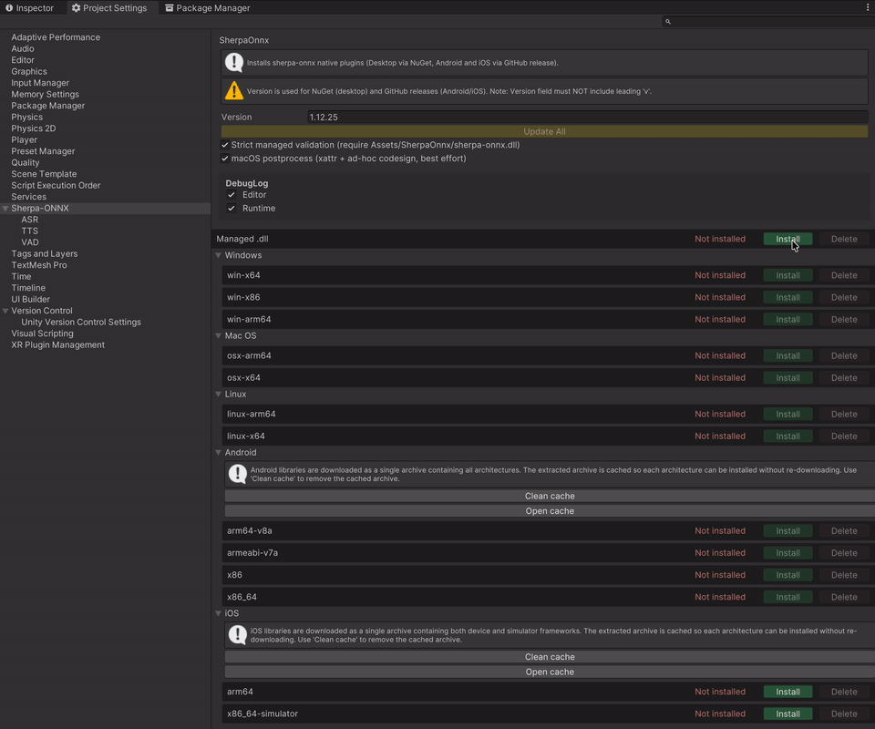
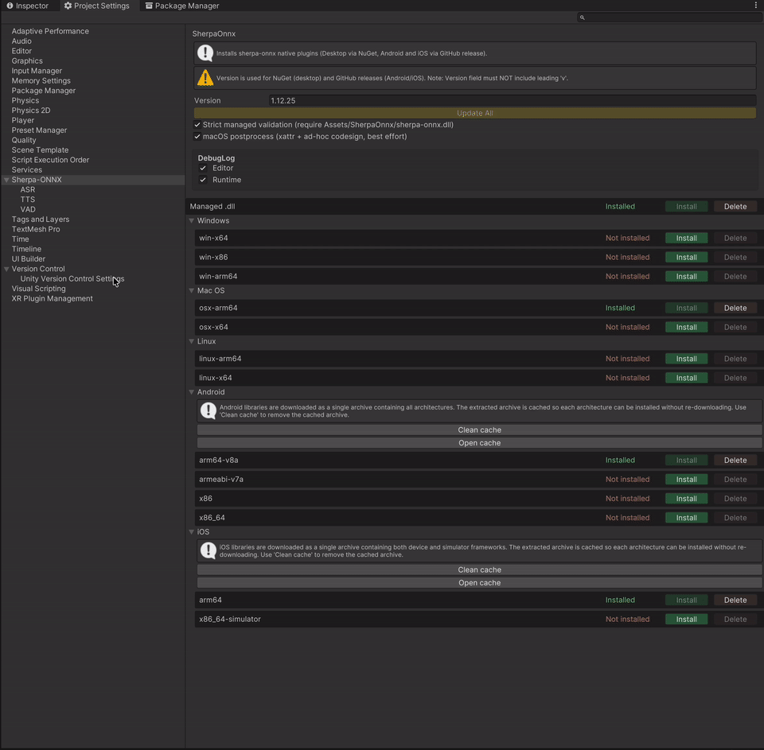

# Unity-Sherpa-ONNX

Unity integration plugin for [sherpa-onnx](https://github.com/k2-fsa/sherpa-onnx) — an open-source speech toolkit powered by ONNX Runtime.

## 🗺️ Feature Roadmap

| Feature | Description | Status |
|---------|-------------|--------|
| **Text-to-Speech (TTS)** | Offline speech synthesis — VITS, Matcha, Kokoro, Kitten, ZipVoice, Pocket (voice cloning) | ✅ Done |
| **Speech Recognition (ASR)** | Offline and streaming speech-to-text — Zipformer, Paraformer, Whisper, SenseVoice, Moonshine | ✅ Done |
| **Voice Activity Detection (VAD)** | Speech/silence segmentation for efficient ASR — Silero VAD, TEN-VAD | ✅ Done |
| **Keyword Spotting (KWS)** | Lightweight always-on keyword detection from microphone | 📋 Planned |
| **Speaker ID & Diarization** | Speaker identification by voice, who-spoke-when segmentation | 📋 Planned |
| **Audio Tools** | Audio tagging, speech enhancement, punctuation restoration, language identification | 📋 Planned |

## 🖥️ Supported Platforms

| Platform | Architectures |
|----------|--------------|
| 🪟 Windows | x64, x86, arm64 |
| 🍎 macOS | x64, arm64 |
| 🐧 Linux | x64, arm64 |
| 🤖 Android | arm64-v8a, armeabi-v7a, x86, x86_64 |
| 📱 iOS | arm64, x86_64-simulator |

## 💡 Why This Plugin

Integrating sherpa-onnx into a Unity project normally requires manual native library setup, platform-specific
workarounds, and custom C# bindings. This plugin handles all of that out of the box.

### ⚡ Easy Setup

- 🔌 **One-click library install** — open Project Settings, pick a version, click Install. Native libraries for
  Windows, macOS, Linux, Android, and iOS are downloaded and configured automatically.
- 📥 **One-click model import** — paste a model URL, the importer downloads, extracts, auto-detects the model
  type, and creates a ready-to-use profile. No manual config editing.
- 🔄 **Update All** — change the version number and update every installed platform at once.

### 🔧 Platform Solutions

The plugin solves real-world platform issues that are not addressed by sherpa-onnx itself:

| Problem | Platform | What the plugin does |
|---------|----------|----------------------|
| 📦 **StreamingAssets locked inside APK** | Android | Extracts model files to `persistentDataPath` on first launch with version tracking and progress reporting. Skips re-extraction on subsequent launches. |
| 🌍 **Non-US locale breaks native code** | Android | Wraps native calls with a locale guard that temporarily sets `LC_NUMERIC` to `"C"`, preventing comma-as-decimal crashes in sherpa-onnx's float parsing. |
| 🍏 **No dynamic library loading** | iOS | Builds a patched `sherpa-onnx.dll` with `DllImport("__Internal")` and downloads it automatically during install. |
| ✂️ **Xcframework architecture bloat** | iOS | Filters xcframeworks to only the target architecture (device or simulator) during install. |
| 🎙️ **Microphone not actually recording** | Unity (all) | Plays a silent AudioSource on the mic clip to force the device to start recording — a known Unity workaround. |
| ⏳ **Microphone readiness delay** | Unity (all) | Polls `Microphone.GetPosition()` with a configurable timeout before starting capture. |
| 🎵 **Sample rate mismatch** | All | Built-in resampler converts any input rate to the model's expected rate (typically 16 kHz). |
| 🔐 **Microphone permission** | Android / iOS | Async permission request with `UniTask` — returns `false` gracefully if denied. iOS waits 1s after the permission dialog so the AVAudioSession can settle before capture starts. |
| 🎧 **TTS playback breaks mic capture** | iOS / Android | `AudioSessionBridge` switches AVAudioSession between PlayAndRecord/Playback on iOS, and sets `AudioManager.MODE_IN_COMMUNICATION` + speakerphone on Android — engaging the platform AEC/AGC so the mic does not return near-silence after TTS. Public API for projects that want to drive it manually. |
| 🗣️ **Native TTS callbacks unsupported on IL2CPP** | iOS / Android / IL2CPP Standalone | sherpa-onnx C# bindings wrap user callbacks in closures that IL2CPP cannot marshal to native. The plugin auto-falls-back `GenerateAsync` (and other callback-using paths) to the callback-less `Generate` on IL2CPP so TTS keeps working — and ships a **Sentence Queue** API (`ITtsService.Speak(text, audio, ct, lookAhead)`) that delivers the same low-latency long-text experience as native streaming, but in pure C# with `lookAhead` parallel pre-generation and works on every scripting backend. |

> ⚙️ Microphone settings (sample rate, buffer length, start timeout, resampling mode, audio session
> management) are configurable via `Edit → Project Settings → Sherpa-ONNX → Microphone` or
> `microphone-settings.json` in StreamingAssets.

---

## 📦 Installation

### Option 1 - Installer

- [**⬇️ Download Installer**](https://github.com/Ponyu-dev/Unity-Sherpa-ONNX/releases/latest/download/SherpaOnnxInstaller.unitypackage)
- 📂 Import installer into Unity project
  - Double-click the file — Unity will open it
  - OR: Unity Editor → **Assets → Import Package → Custom Package**, then choose the file
- The installer adds OpenUPM scoped registry and resolves the package automatically

### Option 2 - OpenUPM (Scoped Registry)

- 📂 Open `Packages/manifest.json` in your project
- ✏️ Add the scoped registry and dependency:
  ```json
  {
    "scopedRegistries": [
      {
        "name": "OpenUPM",
        "url": "https://package.openupm.com",
        "scopes": [
          "com.ponyudev.sherpa-onnx",
          "com.cysharp.unitask"
        ]
      }
    ],
    "dependencies": {
      "com.ponyudev.sherpa-onnx": "0.1.0"
    }
  }
  ```
- ✅ Unity will resolve and download the package automatically

### Option 3 - OpenUPM CLI

- 📦 Install [openupm-cli](https://openupm.com/docs/getting-started.html#installing-openupm-cli)
- ▶️ Run the command in your project folder:
  ```bash
  openupm add com.ponyudev.sherpa-onnx
  ```
- ✅ Dependencies are resolved automatically

### Option 4 - Git URL

- ⚠️ **Install UniTask first** — open **Window → Package Manager**, click **+** → **Add package from git URL...** and paste:
  ```
  https://github.com/Cysharp/UniTask.git?path=src/UniTask/Assets/Plugins/UniTask
  ```
- 🔗 Then add **Sherpa-ONNX** the same way:
  ```
  https://github.com/Ponyu-dev/Unity-Sherpa-ONNX.git
  ```

---

## 🔌 Installing Native Libraries



1. Open **Edit → Project Settings → Sherpa ONNX**
2. Set the desired sherpa-onnx version (e.g. `1.12.25`)
3. Click **Install** for each platform you need
4. Use **Update All** when you change the version to update all installed libraries at once

📥 Libraries are downloaded from:
- **Desktop** (Windows, macOS, Linux): [NuGet](https://www.nuget.org/packages?q=org.k2fsa.sherpa.onnx.runtime)
- **Android / iOS native**: [sherpa-onnx GitHub releases](https://github.com/k2-fsa/sherpa-onnx/releases)
- **iOS managed DLL**: this repository's [GitHub releases](https://github.com/Ponyu-dev/Unity-Sherpa-ONNX/releases) (see below)

---

## 🗣️ Text-to-Speech (TTS)

Offline speech synthesis with pooling and caching. Supports 6 model architectures.

### Setting Up TTS Models



1. Open **Project Settings > Sherpa-ONNX > TTS**
2. Click **Import from URL** and paste a model archive link
3. The importer downloads, extracts, and auto-configures the profile
4. Select the **Active profile** to use at runtime

### Key features:

- 🧠 **6 model architectures** — Vits (Piper), Matcha, Kokoro, Kitten, ZipVoice, Pocket
- 🔍 **Auto-detection** — model type and paths are configured automatically from the archive
- ⚡ **Int8 quantization** — one-click switch between normal and int8 models
- 🚀 **Flexible deployment** — Local (StreamingAssets), Remote (runtime download), or LocalZip (compressed at build time)
- 🎛️ **Matcha vocoder selector** — choose and download vocoders independently
- ♻️ **Cache pooling** — configurable pools for audio buffers, AudioClips, and AudioSources
- 🛑 **Runtime control** — cancellation, handle-based stop / fade-out, parallel-handle StopAll, sentence-queue and streaming playback for long texts

### 📖 Documentation

- [Models Setup Guide](Docs/tts-models-setup.md) — Editor UI, importing, profiles, deployment options
- [Runtime Usage Guide](Docs/tts-runtime-usage.md) — MonoBehaviour, VContainer, Zenject examples, API reference

---

## 👂 Speech Recognition (ASR)

Offline file recognition and real-time streaming with microphone. Supports 15 offline and 5 online model architectures.

### Setting Up ASR Models


1. Open **Project Settings > Sherpa-ONNX > ASR**
2. Select the **Offline** or **Online** tab
3. Click **Import from URL** and paste a model archive link
4. The importer downloads, extracts, and auto-configures the profile
5. Select the **Active profile** to use at runtime

### Key features:

- 🧠 **15 offline + 5 online architectures** — Zipformer, Paraformer, Whisper, SenseVoice, Moonshine, and more
- 🔍 **Auto-detection** — model type and paths are configured automatically from the archive
- ⚡ **Int8 quantization** — one-click switch between normal and int8 models
- 🎙️ **Streaming recognition** — real-time microphone capture with partial and final results
- 🏊 **Engine pool** — multiple concurrent recognizer instances for offline ASR
- ⏹️ **Endpoint detection** — configurable silence rules for automatic utterance segmentation

### 📖 Documentation

- [Models Setup Guide](Docs/asr-models-setup.md) — Editor UI, importing, profiles, offline/online tabs
- [Runtime Usage Guide](Docs/asr-runtime-usage.md) — MonoBehaviour, VContainer, Zenject examples, API reference

---

## 🔊 Voice Activity Detection (VAD)

Speech/silence segmentation for efficient ASR pipelines. Supports Silero VAD and TEN-VAD models.

### Setting Up VAD Models


1. Open **Project Settings > Sherpa-ONNX > VAD**
2. Click **Import from URL** and paste a model archive link
3. The importer downloads, extracts, and auto-configures the profile
4. Select the **Active profile** to use at runtime

### Key features:

- 🧠 **2 model architectures** — Silero VAD, TEN-VAD
- 🔍 **Auto-detection** — model type and paths are configured automatically from the archive
- 🎛️ **Configurable parameters** — threshold, min silence/speech duration, window size
- 🔗 **VAD + ASR pipeline** — segment audio by voice activity, then recognize each segment

### 📖 Documentation

- [Models Setup Guide](Docs/vad-models-setup.md) — Editor UI, importing, profiles, configuration
- [Runtime Usage Guide](Docs/vad-runtime-usage.md) — MonoBehaviour, VContainer, Zenject examples, API reference

---

## 🍏 Why the iOS Managed DLL Is Hosted Here

On desktop and Android, Unity loads native code via dynamic libraries (`.dll`, `.so`, `.dylib`).
The managed C# binding (`sherpa-onnx.dll`) uses `DllImport("sherpa-onnx-c-api")` to find them at runtime.

iOS does **not** support dynamic loading. All native code must be statically linked into the app binary.
This means the managed DLL must use `DllImport("__Internal")` instead of `"sherpa-onnx-c-api"`.

The upstream sherpa-onnx NuGet package ships with the standard `"sherpa-onnx-c-api"` binding, which does not work on iOS.
To solve this, the `Tools~/` scripts in this repository:

1. Take the official C# sources from `sherpa-onnx/scripts/dotnet/`
2. Patch `Dll.cs` to replace `"sherpa-onnx-c-api"` with `"__Internal"`
3. Build a custom `sherpa-onnx.dll` targeting `netstandard2.0`
4. Publish it as a GitHub release with tag `sherpa-v{version}`

The plugin's iOS install pipeline downloads this patched DLL automatically.

## 🏷️ Scripting Define Symbol

After installing any library, the plugin automatically adds **`SHERPA_ONNX`** to Scripting Define Symbols for all build targets. This allows you to guard runtime code that depends on sherpa-onnx:

```csharp
#if SHERPA_ONNX
    var recognizer = new OnlineRecognizer(config);
#endif
```

The define is removed automatically when all libraries are uninstalled.

## 📋 Requirements

- Unity 2022.3 or later
- `com.unity.sharp-zip-lib` 1.4.1+ (added automatically as a dependency)

## 📄 License

[Apache 2.0](LICENSE)
